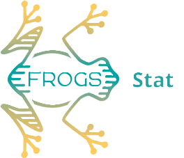

<!-- <p align="center">
 <a href="http://frogs.inrae.fr/">
  
  
 </a><a href="http://frogs.inrae.fr/">
  
  
 </a>
</p> -->


<div style="text-align: center;">
  <!-- Première image (plus grande) -->
  <div style="margin-bottom: 10px;">
    <a href="http://frogs.inrae.fr/">
      
    </a>
  </div>

  <!-- Trois images en ligne -->
  <div style="display: flex; justify-content: center;">
    <a href="http://frogs.inrae.fr/">
      
    </a>
    <a href="http://frogs.inrae.fr/">
      
    </a>
    <a href="http://frogs.inrae.fr/">
      
    </a>
  </div>
</div>

Visit our web site : http://frogs.inrae.fr/

[](https://github.com/geraldinepascal/FROGS-wrappers/releases)      [](https://github.com/geraldinepascal/FROGS-wrappers/actions/workflows/pr.yaml)


# Description

FROGS is a workflow designed to produce an ASV count matrix from high depth sequencing amplicon data.

FROGS also provide functionnal tools for functionnal abundance prediction, and statistical tools to explore ASV count table and taxonomical affiliations.

FROGS-wrappers allow to add FROGS on a Galaxy instance.

# Table of content

* [Installing FROGS\-wrappers](#installing-frogs-wrappers)
* [Upload and configure the databanks](#upload-and-configure-the-databanks)
* [Galaxy configuration](#galaxy-configuration)
  * [Avoid FROGS HTML report sanitization](#avoid-FROGS-HTML-report-sanitization)
  * [Set memory and parallelisation settings](#set-memory-and-parallelisation-settings)
* [License](#license)
* [Copyright](#copyright)
* [Citation](#citation)
* [Contact](#contact)

# Installing FROGS-wrappers

FROGS and is data manager are available on the Toolshed (owner : frogs).

It will install FROGS thanks to [conda](https://anaconda.org/bioconda/frogs), download XML tools and well configure them in your Galaxy.

The 28 FROGS tools are wrapped in 4 Galaxy tools: 
* FROGS_Core tools is composed of a Main tools wrapper and a Companion tools wrapper, each including 8 FROGS tools : https://toolshed.g2.bx.psu.edu/view/frogs/frogs_core
* FROGS_Stat tool including 9 FROGS tools : https://toolshed.g2.bx.psu.edu/view/frogs/frogs_stat
* FROGS_Func tool including 3 FROGS tools: https://toolshed.g2.bx.psu.edu/view/frogs/frogs_func

To install FROGS-wrappers, you can follow the official Galaxy documentation : https://galaxyproject.org/admin/tools/add-tool-from-toolshed-tutorial/. You may install tools via Galaxy admin interface or in commande line using Ephemeris.

For ephemeris, you can adapt the yaml file : 
```
install_tool_dependencies: True
install_repository_dependencies: True
install_resolver_dependencies: True

tools:
- name: frogs_core
  owner: frogs
  tool_panel_section_label: FROGS
  tool_shed_url: https://toolshed.g2.bx.psu.edu/
- name: frogs_stat
  owner: frogs
  tool_panel_section_label: FROGS
  tool_shed_url: https://toolshed.g2.bx.psu.edu/
- name: frogs_func
  owner: frogs
  tool_panel_section_label: FROGS
  tool_shed_url: https://toolshed.g2.bx.psu.edu/
``` 
This will create a FROGS section in your Galaxy tool panel, and install or update FROGS wrapper tools.

# Upload and configure the databanks

Databanks are defined in `loc` files and `loc` files are defined in Galaxy datatable.

In order to use the FROGS_Core tools, you must filled 3 datatables. We provide different databases for each of them that you simply need to download them and add them in the corresponding `loc` files.

- Assignation databank (for taxonomic_affiliation wrapped tool)

  URL : http://genoweb.toulouse.inra.fr/frogs_databanks/assignation

  loc file :`frogs_db.loc`

FROGS provides a data_manager (installable via the toolshed). It concerns only taxonomical assignation databank which are listed here : http://genoweb.toulouse.inra.fr/frogs_databanks/assignation/FROGS_databases.tsv.

  You may choose to download all formatted databases, or filter them on:

    * date : all available database since DATE
    * amplicon : ex: 16S
    * base : ex: SILVA
    * filters : this column is not always filled, but for example, we propose SILVA 16S database filtered on pintail score
    * version : ex : 138.1

Datatables will be added in `<Galaxy_Dir>/config/shed_tool_data_table_conf.xml` 

Loc files will be in : `tool-data/toolshed.g2.bx.psu.edu/repos/frogs/frogs/<RANDOM>/`

You may modify the directory where you want to store reference files by changing  the `galaxy_data_manager_data_path` in the `galaxy.yml` files. All FROGS databases will be placed in a `frogs_db` directory.

Since FROGS-wrappers 3.2.3+galaxy2, FROGS datamanager have been published in it's own toolshed repository : https://toolshed.g2.bx.psu.edu/view/frogs/data_manager_frogs/

To remove previous installed datamanager, simply remove `<data_manager> ... </data_manager>` sections in your `shed_data_manager_conf.xml` galaxy config file.
Previously `frogs_db.loc` are in `tool-data/toolshed.g2.bx.psu.edu/repos/frogs/frogs/*/frogs_db.loc` and will still be available in all FROGS affiliation tools you have installed, do not remove it until you are sure that defined reference databases are useless.


- Contaminant databank (cluster_filters wrapped tool)

  URL : http://genoweb.toulouse.inra.fr/frogs_databanks/contaminants

  loc file : `frogs_contaminant_db.loc`
  

- Hyper variable in length amplicon databank (affiliation_postprocess wrapped tool)

  URL : http://genoweb.toulouse.inra.fr/frogs_databanks/HVL

  loc file : `frogs_HVL.loc`
  
In order to use the FROGS_Func tools, you must filled 3 other .loc files which must indicate the paths to the reference files of PICRUSt2 (present in the directory of the tool installed via conda) :

- Reference tree file for placing ASV sequences (picrust2_placeseq_and_copynumber wrapped tool)
  
  loc file : `frogs_picrust2_default_dir.loc`
  

- Copy number of gene families present in referenced genomes (picrust2_functions wrapped tool)
  
  loc file : `frogs_picrust2_marker_table.loc`
  

- Pathways functionnal mapping file (picrust2_pathways wrapped tool)
  
  loc file : `frogs_picrust2_pathway_map.loc`

# Galaxy configuration

## Avoid FROGS HTML report sanitization

By default Galaxy sanitizes HTML outputs to prevent XSS attacks.
FROGS, for almost all tools, outputs reports in HTML format. To allow their visualisation inside Galaxy, we need to avoid the Galaxy sanitization.

Via Galaxy admin interface and its `Manage Allowlist` menu, you can manage a whitelist of tools whose outputs will not be sanitized:
* FROGS Core 1-Main
* FROGS Core 2-Companion
* FROGS Func
* FROGS Stat

## Set memory and parallelisation settings

If you have more than one CPU, it is recommended to increase the number of CPUs used by tools.

All CPUs must be on the same computer/node.


   * Specifications

     |        Tool         |     CPU     |  Total RAM  | 
     | :-----------------: | :---------: | :---------: | 
     | FROGS Core 1-Main   |     16      | 48G or more | 
     | FROGS Core 2-Companion |     -    | 10G or more | 
     | FROGS Func          |      16     | 24G or more | 
     | FROGS Stat          |      -      | 10G or more | 
     
   * Galaxy configuration

     You need to add `destiantion` sections (one per tool) in the `<Galaxy-Dir>/config/job_conf.xml`

# License
    GNU GPL v3

# Copyright
    2025 INRAE

# Citation

Depending on which type of amplicon you are working on (mergeable or unmergeable), please cite  one of the two FROGS publications:
* [*Escudie F., et al. Bioinformatics, 2018. FROGS: Find, Rapidly, OTUs with Galaxy Solution.*](https://doi.org/10.1093/bioinformatics/btx791)
* [*Bernard M., et al. Briefings in Bioinformatics, 2021. FROGS: a powerful tool to analyse the diversity of fungi with special management of internal transcribed spacers.*](https://doi.org/10.1093/bib/bbab318)

# Contact
    frogs-support@inrae.fr

